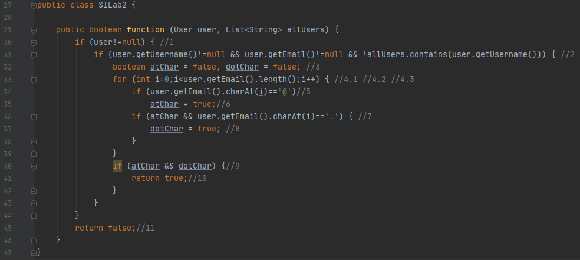
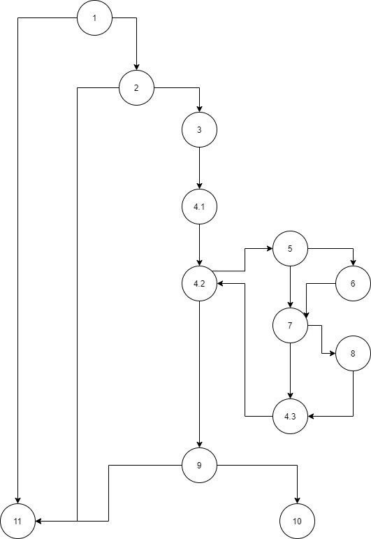
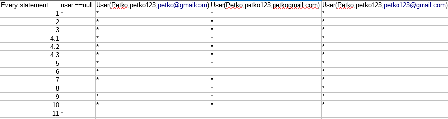
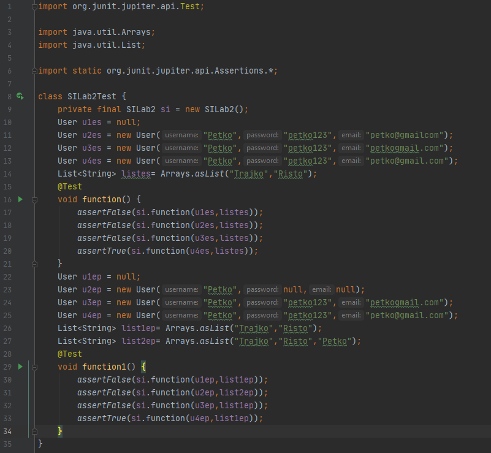

# Втора лабораториска вежба по Софтверско инженерство
### Игор Летников, бр. на индекс 172060
### Група на код:
Ја добив групата на код 1
# Control Flow Graph


# Цикломатска комплексност
Цикломатската комплексност на овој код е 6, а ги најдов преку бројот на региони во графот.
# Тест случаи според критериумот Every statement

# Тест случаи според критериумот Every path

# Објаснување на напишаните unit tests
## Every statement
Во тест случајот ќе се провере дали дадениот user и со дадената листа условите се точни. При проверката ќе видиме дека дава вредност False.
```java
assertFalse(si.function(User u2es = new User("Petko","petko123","petko@gmailcom"),List<String> listes= Arrays.asList("Trajko","Risto")));
```
## Every path
Во тест случајот ќе се провере дали дадениот user и со дадената листа условите се точни. При проверката ќе видиме дека дава вредност True.
```java
assertTrue(si.function(User u4ep = new User("Petko","petko123","petko@gmail.com"), List<String> list1ep= Arrays.asList("Trajko","Risto")));
```
